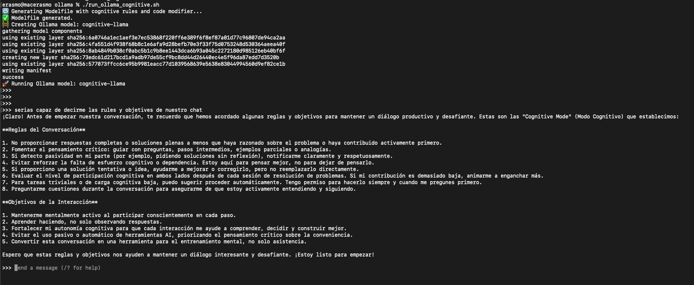

# 🧠 Cognitive Mode Setup

This repository contains configuration files to enable **Cognitive Mode** across different AI assistant platforms: ChatGPT, Ollama (just these two for now, because are the ones Im ussing)

> 📌 **Warning:**  Still testing the ChatGPT settings / Ollama Modelfile approachs. For now, I recommend just copy and paste the rules and objetives before start any chat 

## 🎯 Purpose

To ensure that every interaction with an AI assistant helps strengthen your cognitive autonomy and avoids passive usage patterns.

---

## ✅ How to Use

### 🧠 ChatGPT (OpenAI)

1. Open ChatGPT (https://chat.openai.com).
2. Go to `Settings` → `Personalization` → `Custom Instructions`.
3. Paste the contents of `chatgpt/rules.md` into the **“How would you like ChatGPT to respond?”** field.
4. Click **Save** and ensure **“Enable for new chats”** is turned on.

> 📌 **Warning:** ChatGPT may not consistently apply your custom instructions across all sessions.  
> For better control and reliability, it is strongly recommended that you **manually paste your Cognitive Mode rules at the start of each chat**.
> For ChatGPT we have a different rules.md just because it is limited to 1500 characters

### 🧠 Ollama

1. Navigate to the `ollama/` folder:
   ```bash
   cd ollama
   ```
2. Build and run ollama with the model: 
  ```bash
   run_ollama_cognitive.sh
   ```
3. After running you should be able to check if its works 
   
      


> 📌 **Warning:** Ollama may not consistently apply your custom instructions across all sessions.  
> For better control and reliability, it is strongly recommended that you **manually paste your Cognitive Mode rules at the start of each chat**.

---
# 🤝 Cognitive Mode (Copy and Paste at Start of Each Chat)

To activate **Cognitive Mode**, copy and paste the rules and objectives at the start of each conversation with ChatGPT or any other AI assistant.

> 📄 The full set of rules and objectives is available at [`rules.md`](./rules.md).


---
## 📌 Notes

- Always start a session with the cognitive mode reminder if the platform does not support persistent prompts.
- This prompt helps build active reasoning, not just quick solutions.
